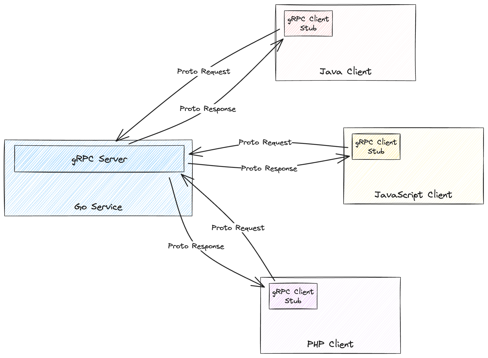
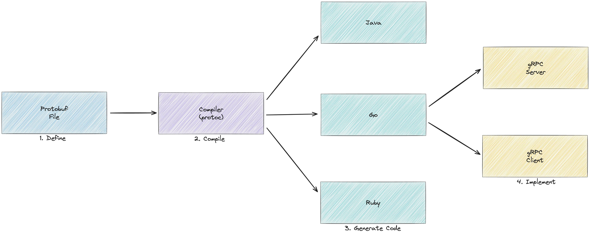
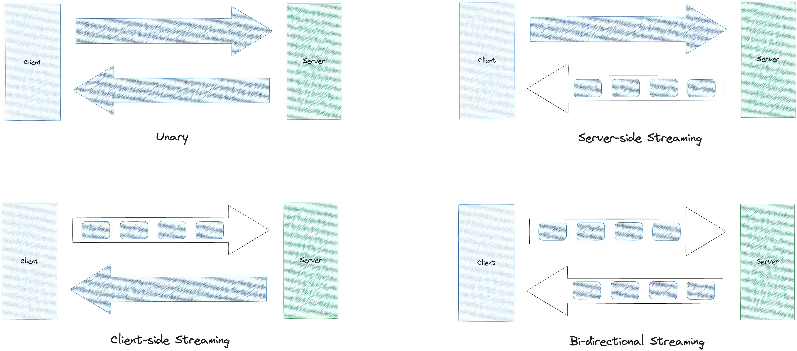

# go-grpc

## Workflows

* Define a Protobuf Contract: Define the RPC methods and the request/response structures using Protobuf.
* Compile Protobuf Files: Use the Protobuf compiler *(protoc) to generate client and server interfaces. This can be run with various plugins for the desired programming languages.
* Implement Server Logic: Implement the server logic by providing concrete implementations of the RPC methods.
* Initialize Client Stubs: Use the generated client stubs to make RPC calls to the server.

## Types of gRPC APIs

gRPC supports four types of APIs:

* *Unary*: A single request followed by a single response.
Example Use Case: Fetching a user profile.
* *Server-side Streaming*: A single initial request followed by a stream of responses.
Example Use Case: Streaming log entries or a large dataset.
* *Client-side Streaming*: A stream of requests followed by a single final response.
Example Use Case: Uploading a file in chunks.
* *Bi-directional Streaming*: Both client and server send a stream of messages to each other independently.
Example Use Case: Real-time chat application.